## 1) Data Visualization

R has several systems for making graphs, but *ggplot2* is one of the most elegant and versatile. We start by visualizing data using *ggplot2* by creating a simple scatter plot and use it to introduce aesthetic mappings and geometric objects - the fundamental building blocks of *ggplot2*. We then look at visualizing distributions of single variables, relationships between two or more variables and saving plots.

---

### First Steps

In addition to *tidyverse* we use the *palmerpenguins* package, which includes the *penguins* dataset. Do penguins with longer flippers weigh more or less than penguins with shorter flippers? What does the relationship between flipper length and body mass look like? Does the relationship vary by the species of the penguin r the island where the penguin lives? The *penguins* data frame contains 344 observations. We define the following:

- *Variable*

A quantity, quality or property that you can measure

- *Value*

The state of a variable when you measure it. The value of a variable may change from measurement to measurement.

- *Observation*

A set of measurements made under similar conditions. An observation will contain several values, each associated with a different variable. This may be referred to as a data point.

- *Tabular data*

A set of values, each associated with a variable and an observation.

In this context, a variable refers to an attribute of all the penguins, and an observation refers to all the attributes of a single penguin. The *penguins* data frame is given in the form of a *tibble*, which is common to the tidyverse.

---

### Creating a plot

With *ggplot2*, you begin a plot with the function $\texttt{ggplot()}$, defining a plot object that you then add *layers* to. The first argument of $\texttt{ggplot()}$ is the dataset to use in the graph. Next, we need to tell $\texttt{ggplot()}$ how the information from our data will be visually represented. The $\texttt{mapping}$ argument of the function defines how variables in your dataset are mapped to the aesthetics of your plot. The $\texttt{mapping}$ argument is always defined in the $\texttt{aes()}$ function. Defining the observations from our data frame on our plot requires us to define a *geom*: the geometrical object that a plot uses to represent the data. People often describe plots by the type of geom that the plot uses. For example, bar charts use `geom_bar` $\mathrm{geom\_bar()}$, line charts use $\texttt{geom\_line()}$, boxplots use $\texttt{geom\_boxplot()}$ and scatter plots use $\texttt{geom\_point()}$. 

```r
# Code 1
# An example plot of penguin flipper length by body mass
ggplot(data = penguins,
       mapping = aes(x = flipper_length_mm, y = body_mass_g)) +
  geom_point()
```

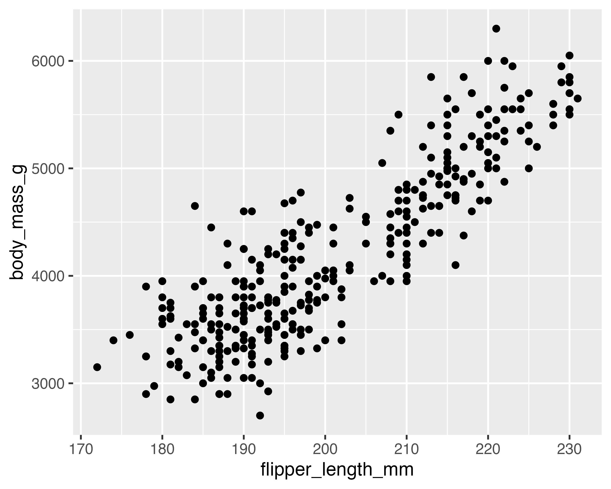

Let us review the warning message: "Removed 2 rows containing missing values ('geom_point()')". We are seeing this message because there are two penguins in our dataset with missing body mass and/or flipper length values. R and ggplot2 do not allow missing values to silently go missing. 

#### Adding Aesthetics and Layers

Let us incorporate species into our plot and see if this reveals any additional insights into the apparent relationship between these variables. To achieve this, we need to modify the aesthetic of the geom.

```r
# Code 2
# An example plot of penguin flipper length by body mass (with colour)
ggplot(data = penguins,
       mapping = aes(x = flipper_length_mm, y = body_mass_g, color = species)) +
  geom_point()
```

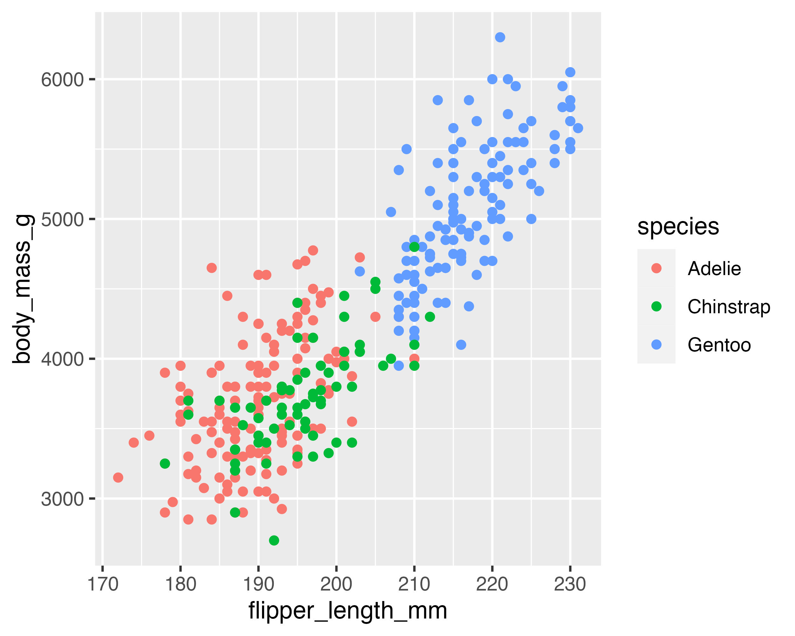

When a categorical variable is mapped to an aesthetic, ggplot2 will automatically assign a unique value of the aesthetic (here a unique value) to each unique level of the variable (each of the three species), a process known as *scaling*.

Let us add one more layer: a smooth curve displaying the relationship between body mass and flipper length. Since this is a new geometric object representing our data, we will add a new geom as a layer on top of our point geom: $\texttt{geom\_smooth()}$, and we will specify that we want to draw the line of best fit on a linear model with method = "lm".

```r
# Code 3
# An example plot of penguin flipper length by body mass (with smooth fit)
ggplot(data = penguins,
       mapping = aes(x = flipper_length_mm, y = body_mass_g, color = species)) +
  geom_point() +
  geom_smooth(method = "lm")
```

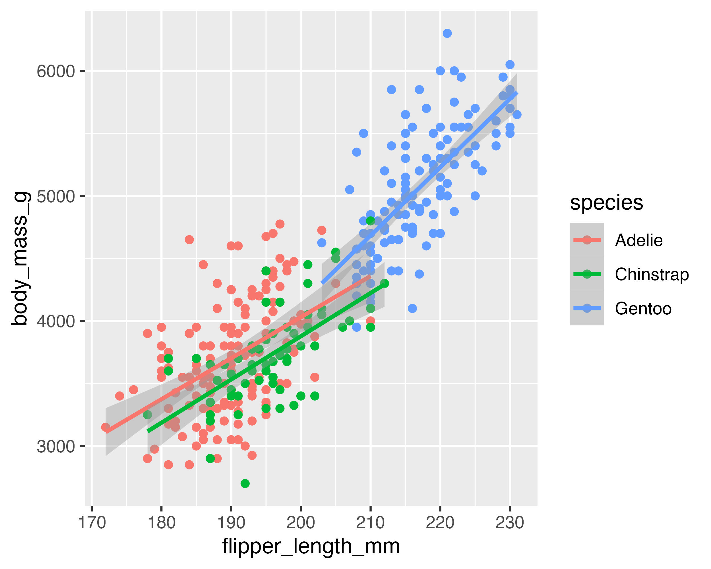

We have successfully added lines, but it has created separate lines for each of the penguin species. When aesthetic mappings are defined in $\texttt{ggplot()}$, at the *global* level, they are passed down to each of the subsequent geom layers of the plot. However, each geom function in ggplot2 can also take a $\texttt{mapping}$ argument, which allows for aesthetic mappings at the *local* level that are added to those inherited from the global level. To create a line for all points we should specify $\texttt{color = species}$ for $\texttt{geom\_point()}$ only.

```r
# Code 4
# An example plot of penguin flipper length by body mass (with fit for species)
ggplot(data = penguins,
       mapping = aes(x = flipper_length_mm, y = body_mass_g)) +
  geom_point(mapping = aes(color = species)) +
  geom_smooth(method = "lm")
```

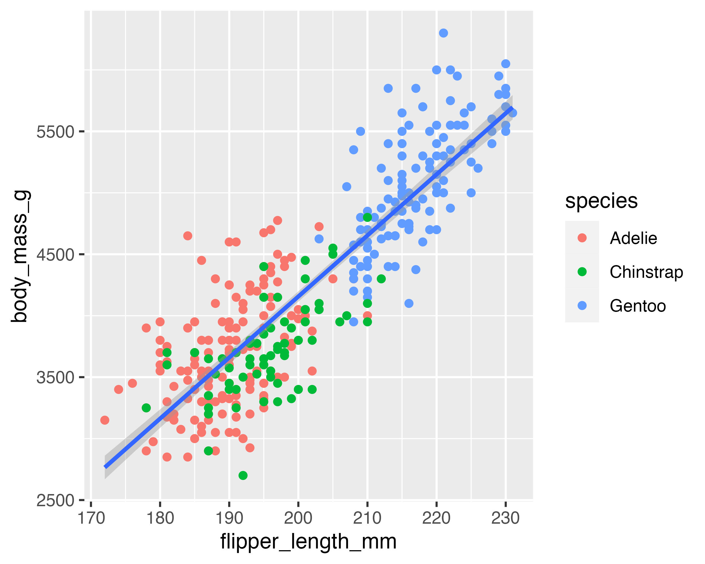

If we wanted to use different shapes for each species of penguins we could map $\texttt{species}$ to the $\texttt{shape}$ aesthetic.

Finally, we can improve the labels of our plot using the $\texttt{labs()}$ function in a new layer. Arguments that can be include: $\texttt{title}$, $\texttt{subtitle}$, $\texttt{x}$, $\texttt{y}$, and $\texttt{color}$ and $\texttt{shape}$, which define the label for the legend.

```r
# Code 5
# An example plot of penguin flipper length by body mass (with labels)
ggplot(data = penguins,
       mapping = aes(x = flipper_length_mm, y = body_mass_g)) +
  geom_point(mapping = aes(color = species)) +
  geom_smooth(method = "lm") +
  labs(title = "Body mass and flipper length",
       subtitle = "Dimensions for Adelie, Chinstrap and Gentoo Penguins",
       x = "Flipper length [mm]",
       y = "Body mass [g]",
       color = "Species",
       shape = "Species")
```

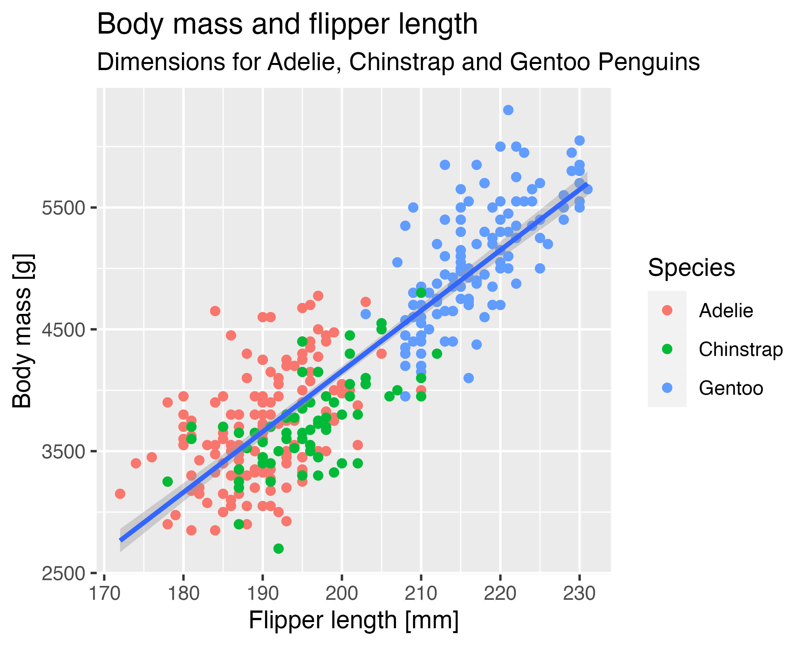

So far we have been very explicit in our calls to $\texttt{ggplot()}$. Typically, the first one or two arguments to a functions are so important they are known instinctively. The first two arguments to $\texttt{ggplot()}$ are $\texttt{data}$ and $\texttt{mapping}$; in future we will not supply those names.

---

### Visualizing Distributions

How you visualize the distribution of a variable depends on the type of variable: categorical or numerical.

#### A Categorical Variable

A variable is *categorical* if it can take only one of a small set of values. To examine the distribution of a categorical variable, you can use a bar chart. In bar plots of categorical values with unordered levels, it is often preferable to reorder the bars based on their frequencies. Doing so requires transforming the variable to a factor (how R handles categorical data) and then reordering the levels of that factor.

```r
# Code 6
# Bar chart with ordered categorical variables
ggplot(penguins, aes(x = fct_infreq(species))) +
  geom_bar()
```

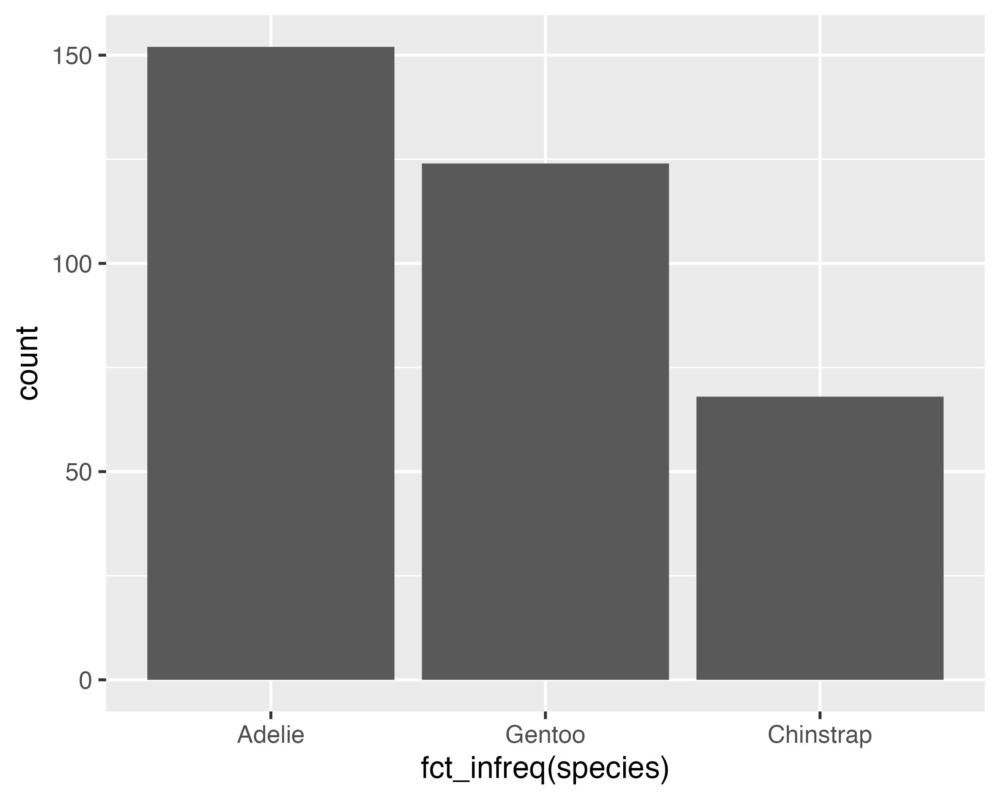

#### A Numerical Variable

A variable is *numerical* if it can take a wide range of numerical values and it is sensible to add, subtract, or take averages with those values. Numerical values can be continuous or discrete. One commonly used visualization for distributions of continuous variables is a histogram.

```r
# Code 7
# A histogram of penguin body mass
ggplot(penguins, aes(x = body_mass_g)) +
  geom_histogram(binwidth = 200)
```

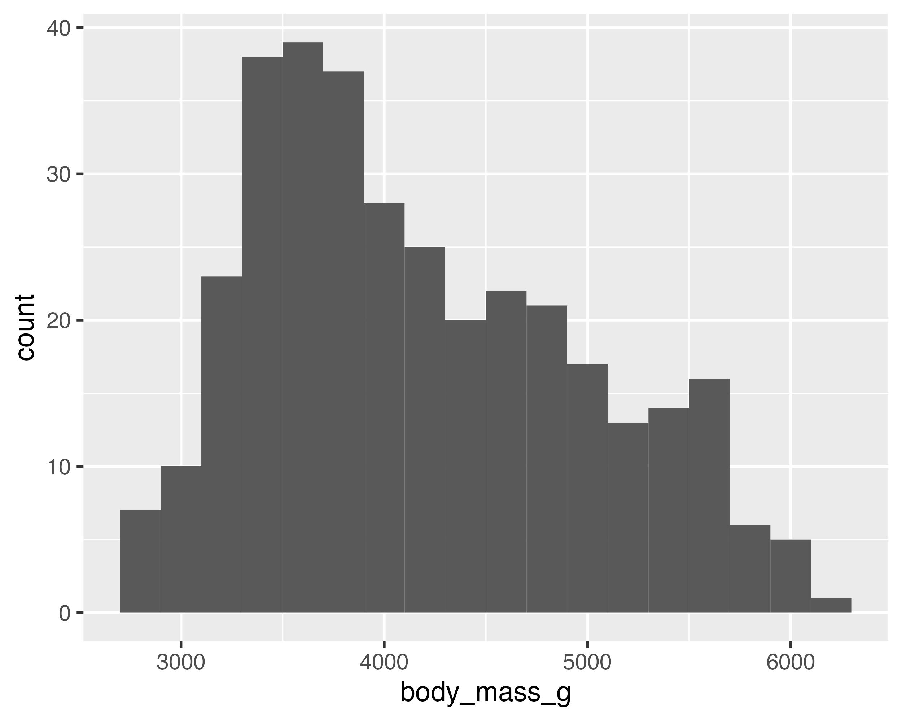

An alternative visualization for distributions of numerical variables is a density plot. A density plot is a smoothed version of a histogram and a practical alternative for continuous data that comes from an underlying smooth distribution.

```r
# Code 8
# A density plot of penguin body mass
ggplot(penguins, aes(x = body_mass_g)) +
  geom_density()
```

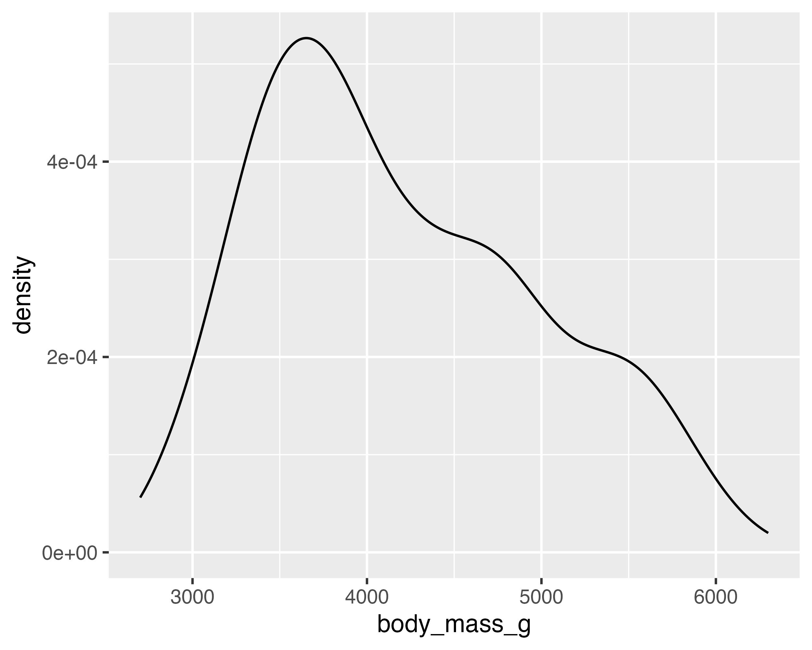

---

### Visualizing Relationships

To visualize a relationship we need to have at least two variables mapped to aesthetics of a plot. We shall go through commonly used plots for visualizing relationships between multiple variables and the geoms used to create them.

#### A Numerical and a Categorical Variable

To visualize the relationship between a numerical and a categorical variable we can use side-by-side box plots. A *boxplot* is a type of visual for measures of percentiles that describe a distribution. Each boxplot consists of:

- A box that indicates the *interquartile range* (IQR), stretching from the 25th percentile of the distribution to the 75th percentile. In the middle of the box is a line that displays the median (50th percentile). These three lines give you a sense of the spread of the distribution and whether the distribution is symmetric about the median.
- Visual points that display observations that fall more than 1.5 times the IQR from either edge of the box.
- A line that extends from each end of the box and goes to the farthest nonoutlier point in your distribution.

We show the distribution of body mass by species using a boxplot $\texttt{geom\_boxplot()}$, or alternatively, we can make density plots with $\texttt{geom\_density()}$. For the density plot we have customized the thickness of the lines using the $\texttt{linewidth}$ argument, additionally, we can map $\texttt{species}$ to both $\texttt{color}$ and $\texttt{fill}$ aesthetics and use the $\texttt{alpha}$ aesthetic to add transparency to the filled density curves. 

```r
# Code 9
# A boxplot of body mass by species
ggplot(penguins, aes(x = species, y = body_mass_g)) +
  geom_boxplot()

# A density plot of body mass by species
ggplot(penguins, aes(x = body_mass_g, color = species, fill = species)) +
  geom_density(linewidth = 0.75, alpha = 0.5)
```

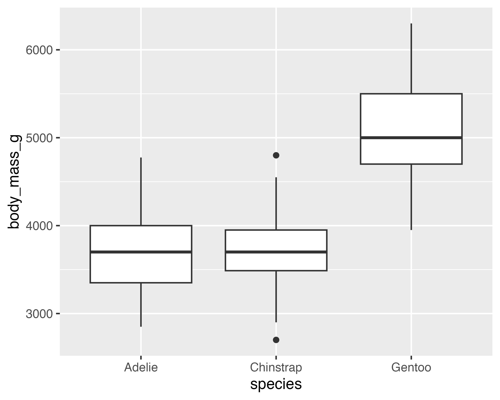

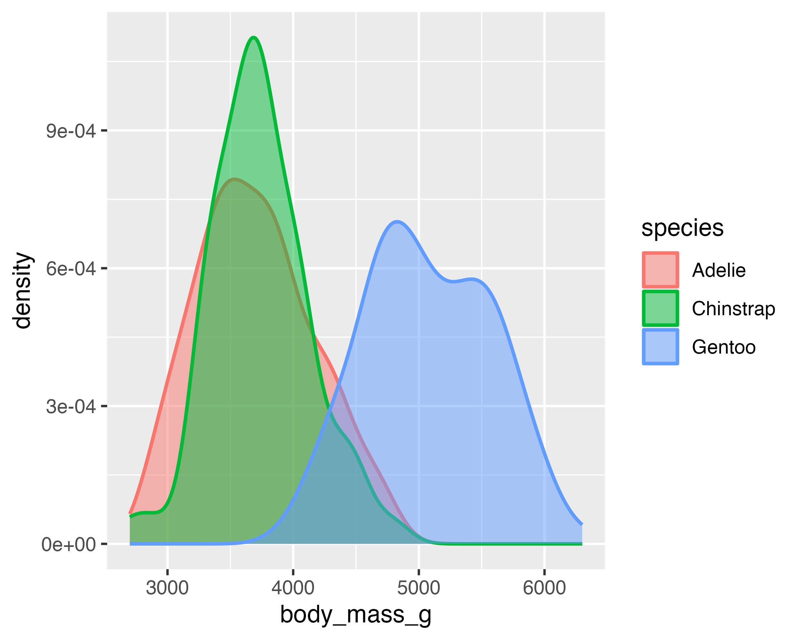

#### Two Categorical Variables

We can use stacked bar plots to visualize the relationship between two categorical variables. For example, the following two stacked bar plots both display the relationship between $\texttt{island}$ and $\texttt{species}$. The first plot shows the frequencies of each species of penguins on each island. The second plot is a relative frequency plot, created by setting $\texttt{position}$ = "$\texttt{fill}$" in the geom, and is more useful for comparing species distributions across islands since it is not affected by the unequal numbers of penguins across the islands. In creating these bar charts, we map the variable that will be separated into bars as the $\texttt{x}$ aesthetic, and the variable that will change the colors inside the bars to the $\texttt{fill}$ aesthetic.

```r
# Code 10
# A stacked bar chart for penguin species on different islands
ggplot(penguins, aes(x = island, fill = species)) +
  geom_bar()

# A relative stacked bar chart for penguins species on different islands
ggplot(penguins, aes(x = island, fill = species)) +
  geom_bar(position = "fill")
```

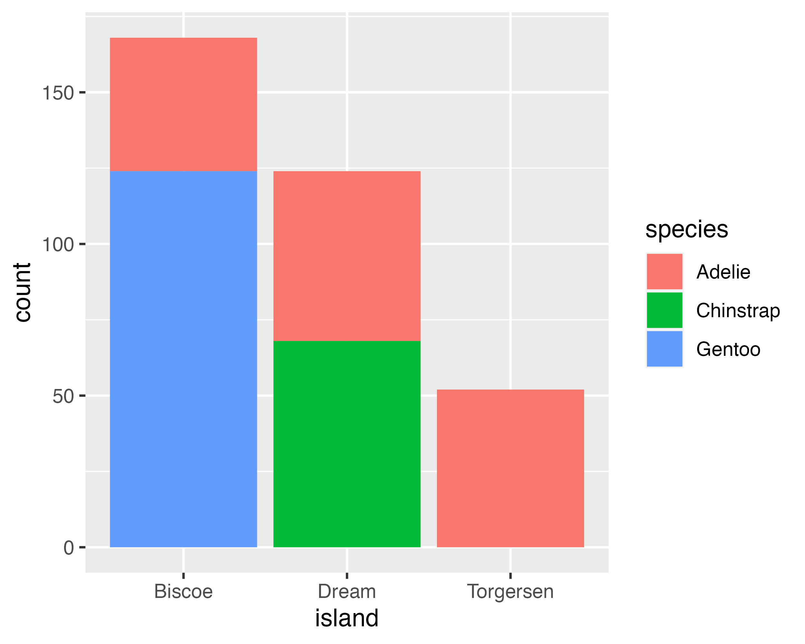
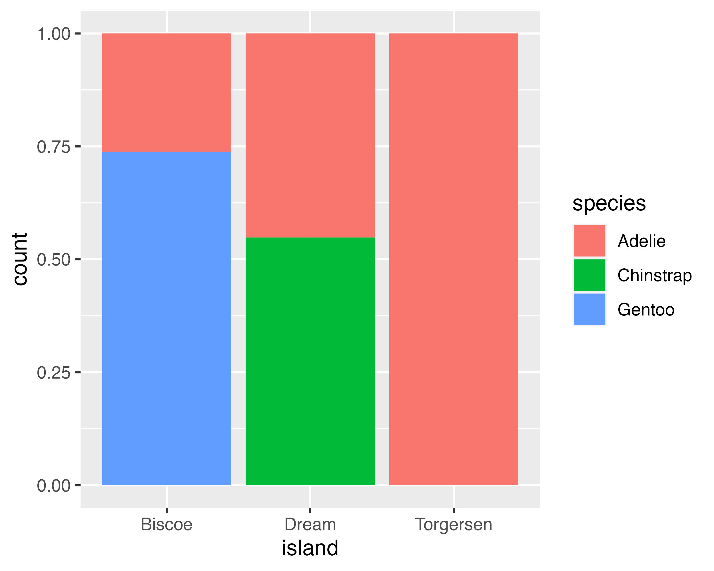

#### Three or More Variables

As we have seen, we can incorporate more variables into a plot by mapping them to additional aesthetics. For example, in the following scatterplot the colors of points represent species, and the shapes of points represent islands.

```r
# Code 11
# A scatterplot where color maps to species and shape maps to island
ggplot(penguins, aes(x = flipper_length_mm, y = body_mass_g)) +
  geom_point(aes(color = species, shape = island))
```

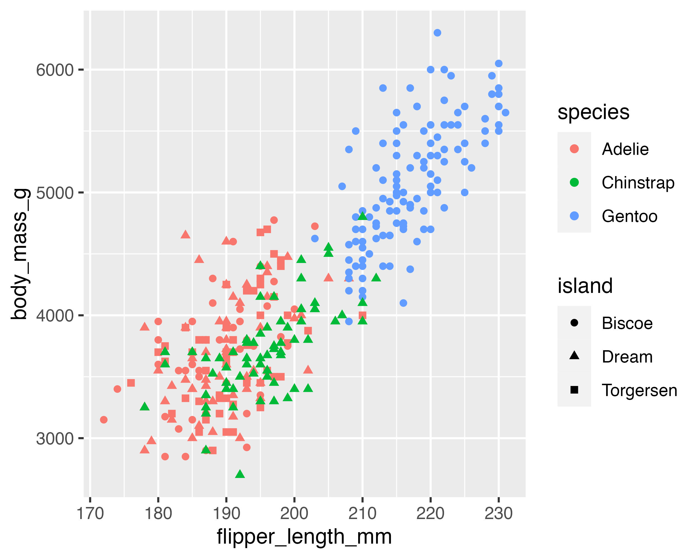

However, adding too many aesthetic mappings to a plot makes it cluttered and difficult to make sense of. Another option, which is particularly useful for categorical variables is to split your plot into *facets*, subplots that each display one subset of the data. To facet your plots by a single variables, use $\texttt{facet\_wrap()}$. The first argument is a formula, which you create with ~ followed by a variable name.

```r
# Code 12
# A scatterplot (as above), in separate subplots
ggplot(penguins, aes(x = flipper_length_mm, y = body_mass_g)) + 
  geom_point(aes(color = species, shape = island)) +
  facet_wrap(~island)
```

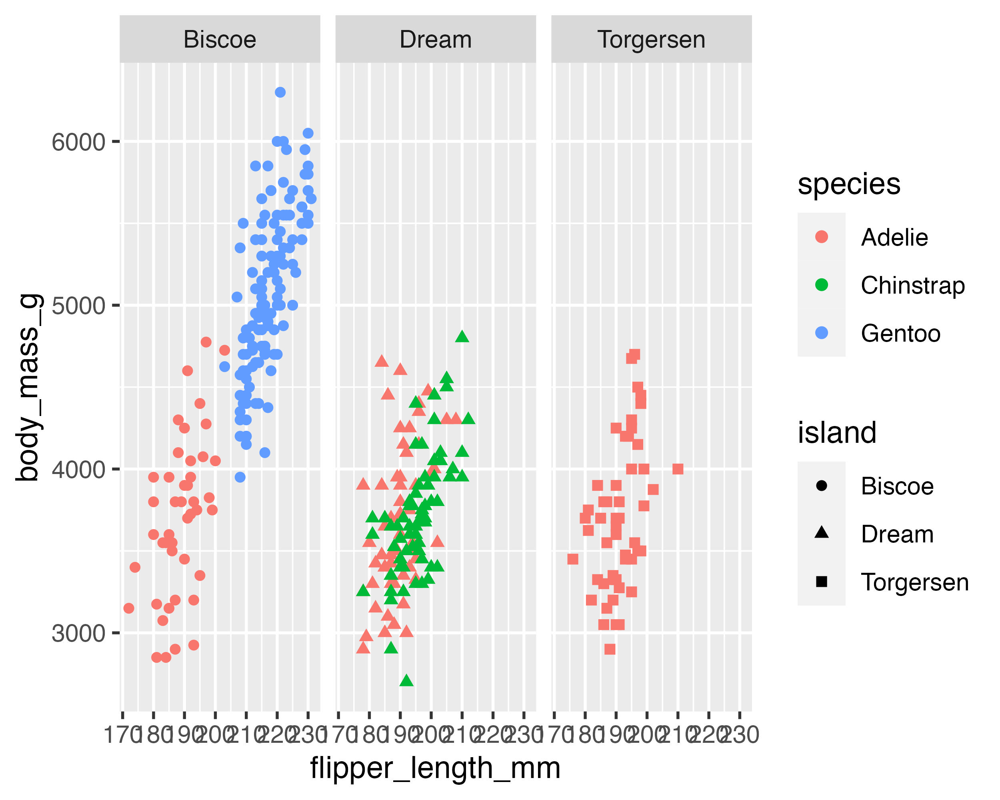

---

### Saving Your Plots

Saving a plot as an image can be done using $\texttt{ggsave()}$, which will save the plot most recently created to your working directory.

```r
# Code 13
# Saving a plot
ggplot(penguins, aes(x = flipper_length_mm, y = body_mass_g)) +
  geom_point()
ggsave(filename = "penguin-plot.png")
```

If you do not specify the $\texttt{width}$ and $\texttt{height}$, they will be taken from the dimensions of the current plotting device. For reproducible code, they should be specified.

---

### Summary

In this chapter we covered the basics of data visualization with ggplot2. We started with the basic idea that a visualization is a mapping from variables in your data to aesthetic properties such as position, color, size and shape. We then increased the complexity and improving the presentation of your plots layer by layer. We saw commonly used plots for visualizing the distribution of a single variable, as well as for visualizing relationships between two or more variables, by levering additional aesthetic mappings and/or splitting your plot into subplots using faceting.
