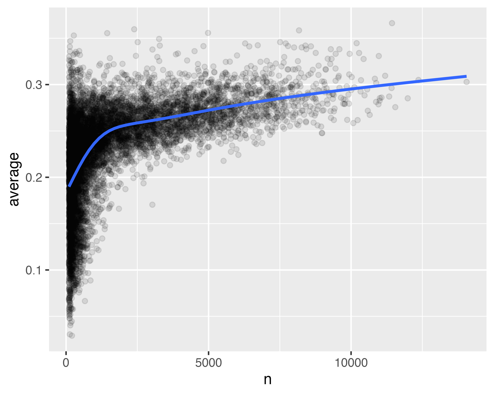

## 3) Data Transformation

Visualization is an important tool for generating insight, but it is rare that you get the data in exactly the right form you need to make the graph you want. Often you will need to create some new variables or summaries to answer your questions with your data. We shall introduce data transformation using the dplyr package and use a new dataset on flights that departed New York City in 2013.

Take careful note of the conflict message that is printed when you load the tidyverse. It tells you that dplyr overwrites some functions in base R. If you want to use the base version of these functions after loading dplyr, you will need to use their full names, such as $\texttt{stats::filter()}$.

---

### nycflights13

To explore the basic dplyr verbs, we are going to use $\texttt{nycflights13::flights}$. This dataset contains all 336,776 flights that departed from New York City in 2013. $\texttt{flights}$ is a tibble, a special type of data frame used by the tidyverse to avoid some common gotchas. They are designed for large datasets, so when printing they only show the first few rows and only the columns that fit on one screen. If you are using RStudio, the most convenient way to view the full dataset is $\texttt{View(flights)}$, which will open an interactive scrollable and filterable view. Otherwise, you can use $\texttt{print(flights, width = inf)}$ to show all columns or $\texttt{glimpse()}$. In these views, the variables are followed by the variable type: $\texttt{<int>}$ for integer, $\texttt{<dbl>}$ for double (real numbers), $\texttt{<chr>}$ for character (strings), and $\texttt{<dttm>}$ for date-time.

---

### dplyr Basics

The vast majority of your data manipulation challenges can be solved with the primary dplyr verbs. They all have things in common:

- The first argument is always a data frame.
- The subsequent  arguments typically describe which columns to operate on, using the variable names (without quotes).
- The output is always a new data frame.

Because each verb does one thing well, solving complex problems will usually require combining multiple verbs, and we will do so with the pipe, |>. dplyr's verbs are organized into four groups based on what they operate on: *rows*, *columns*, *groups* and *tables*. 

---

### Rows

The most important verbs that operate on rows of a dataset are $\texttt{filter()}$, which changes which rows are present without changing their order, and $\texttt{arrange()}$ which changes the order of the rows without changing which are present. We will also discuss $\texttt{distinct()}$, which finds rows with unique values, but unlike $\texttt{arrange()}$ and $\texttt{filter()}$, it can also  optionally modify the columns.

#### $\texttt{filter()}$

$\texttt{filter()}$ allows you to keep rows based on the values of the columns. The first argument is the data frame. The second and subsequent arguments are the conditions that must be true to keep the row.

```r
# Code 1
# All flights that departed more than two hours late
flights |>
  filter(dep_delay > 120)

# Flights that departed on 1st January
flights |>
  filter(month == 1 & day == 1)

# FLights that departed in January or February
flights |>
  filter(month == 1 | month == 2)
```

The operators that you can use include >, >=, <, <=, == and !=. You can also combine conditions with & or , to indicate "and" or | to indicate "or". There is a useful shortcut when you are combining | and ==, namely %in%. It keeps rows where the variable equals one of the values on the right:

```r
# Code 2
# Flights that departed in January or February
flights |>
  filter(month %in% c(1, 2))
```

When you run $\texttt{filter()}$, dplyr executes the filtering operation, creating a new data frame and then prints it. dplyr functions never modify their inputs, so to save the result you need to use the assignment operator.

#### $\texttt{arrange()}$

$\texttt{arrange()}$ changes the order of the rows based on the value of the columns. It takes a date frame and a set of column names to order by. If you provide more than one column name, each additional column will be used to break ties in the values of preceding columns. For example, the following code sorts the data by the departure time:

```r
# Code 3
# Sort the flights by departure time
flights |>
  arrange(year, month, day, dep_time)
```

```output
# A tibble: 336,776 × 19
    year month   day dep_time sched_dep_time dep_delay arr_time sched_arr_time
   <int> <int> <int>    <int>          <int>     <dbl>    <int>          <int>
 1  2013     1     1      517            515         2      830            819
 2  2013     1     1      533            529         4      850            830
 3  2013     1     1      542            540         2      923            850
 4  2013     1     1      544            545        -1     1004           1022
 5  2013     1     1      554            600        -6      812            837
 6  2013     1     1      554            558        -4      740            728
 7  2013     1     1      555            600        -5      913            854
 8  2013     1     1      557            600        -3      709            723
 9  2013     1     1      557            600        -3      838            846
10  2013     1     1      558            600        -2      753            745
# ℹ 336,766 more rows
# ℹ 11 more variables: arr_delay <dbl>, carrier <chr>, flight <int>,
#   tailnum <chr>, origin <chr>, dest <chr>, air_time <dbl>, distance <dbl>,
#   hour <dbl>, minute <dbl>, time_hour <dttm>
# ℹ Use `print(n = ...)` to see more rows
```

You can use $\texttt{desc()}$ on a column inside of $\texttt{arrange()}$ to reorder the data frame based on that column in descending order. For example, this code orders flights from most to least delayed:

```r
# Code 4
# Order the flights from most to least delayed
flights |>
  arrange(desc(dep_delay))
```

```output
# A tibble: 336,776 × 19
    year month   day dep_time sched_dep_time dep_delay arr_time sched_arr_time
   <int> <int> <int>    <int>          <int>     <dbl>    <int>          <int>
 1  2013     1     9      641            900      1301     1242           1530
 2  2013     6    15     1432           1935      1137     1607           2120
 3  2013     1    10     1121           1635      1126     1239           1810
 4  2013     9    20     1139           1845      1014     1457           2210
 5  2013     7    22      845           1600      1005     1044           1815
 6  2013     4    10     1100           1900       960     1342           2211
 7  2013     3    17     2321            810       911      135           1020
 8  2013     6    27      959           1900       899     1236           2226
 9  2013     7    22     2257            759       898      121           1026
10  2013    12     5      756           1700       896     1058           2020
# ℹ 336,766 more rows
# ℹ 11 more variables: arr_delay <dbl>, carrier <chr>, flight <int>,
#   tailnum <chr>, origin <chr>, dest <chr>, air_time <dbl>, distance <dbl>,
#   hour <dbl>, minute <dbl>, time_hour <dttm>
# ℹ Use `print(n = ...)` to see more rows
```

#### $\texttt{distinct()}$

$\texttt{distinct()}$ finds all the unique rows in a dataset. Most of the time, however, you will want the distinct combination of some variables, so you can also optionally supply column names:

```r
# Code 5
# Remove all duplicate rows
flights |>
  distinct()

# Find all unique combinations of origin and destination
flights |>
  distinct(origin, dest)
```

Alternatively, if you want to keep the other columns when filtering for unique rows, you can use the $\texttt{.keep\_all}$ = TRUE option. If you want to find the number of occurrences instead, you are better off swapping $\texttt{distinct()}$ for $\texttt{count()}$, and with the $\texttt{sort}$ = TRUE argument you can arrange them in descending order of number of occurrences.

---

### Columns

There are four important verbs that affect the columns without changing the rows: $\texttt{mutate()}$ creates new columns that are derived from the existing columns, $\texttt{select()}$ changes which columns are present, $\texttt{rename()}$ changes the names of the columns and $\texttt{relocate()}$ changes the positions of the columns.

#### $\texttt{mutate()}$

The job of $\texttt{mutate()}$ is to add new columns that are calculated from the existing columns. In the following we use $\texttt{mutate()}$ to calculate the gain (how much time a delayed flight made up in the air) and average speed.

```r
# Code 6
# Create new columns for gain an average speed
flights |>
  mutate(gain = dep_delay - arr_delay,
         speed = distance / air_time * 60,
         .before = 1)
```

```output
# A tibble: 336,776 × 21
    gain speed  year month   day dep_time sched_dep_time dep_delay arr_time
   <dbl> <dbl> <int> <int> <int>    <int>          <int>     <dbl>    <int>
 1    -9  370.  2013     1     1      517            515         2      830
 2   -16  374.  2013     1     1      533            529         4      850
 3   -31  408.  2013     1     1      542            540         2      923
 4    17  517.  2013     1     1      544            545        -1     1004
 5    19  394.  2013     1     1      554            600        -6      812
 6   -16  288.  2013     1     1      554            558        -4      740
 7   -24  404.  2013     1     1      555            600        -5      913
 8    11  259.  2013     1     1      557            600        -3      709
 9     5  405.  2013     1     1      557            600        -3      838
10   -10  319.  2013     1     1      558            600        -2      753
# ℹ 336,766 more rows
# ℹ 12 more variables: sched_arr_time <int>, arr_delay <dbl>, carrier <chr>,
#   flight <int>, tailnum <chr>, origin <chr>, dest <chr>, air_time <dbl>,
#   distance <dbl>, hour <dbl>, minute <dbl>, time_hour <dttm>
# ℹ Use `print(n = ...)` to see more rows
```

By default, $\texttt{mutate()}$ adds new columns on the right side of your dataset. We can use the $\texttt{.before}$ argument to add the variables to the left side. The . is a sign that $\texttt{.before}$ is an argument to the function, not the name of a new variable. You can also use $\texttt{.after}$ to add after a variable, and in both $\texttt{.before}$ and $\texttt{.after}$ you can use the variable name instead of a position. Alternatively, you can control which variables are kept with the $\texttt{.keep}$ argument. A particularly useful argument is $\texttt{.keep}$ = "used", which specifies that we keep only the columns that were involved or created in the $\texttt{mutate()}$ step.

#### $\texttt{select()}$

It is not uncommon to get datasets with hundreds of variables. In this situation, the first challenge is often just focusing on the variables you are interested in. $\texttt{select()}$ allows you to rapidly zoom in on a useful subset using operations based on the names of the variables:

```r
# Code 7
# Select columns by name
flights |>
  select(year, month, day)

# Select all columns between year and day (inclusive)
flights |>
  select(year:day)

# Select all columns except those from year to day
flights |>
  select(!year:day)

# Select all columns that are characters
flights |>
  select(where(is.character))
```

There are a number of helper functions you can use within select: $\texttt{starts\_with("abc")}$ - matches names that begin with "abc"; $\texttt{ends\_with("abc")}$ - matches names that end with "abc"; $\texttt{contains("abc")}$ - matches names that contain "abc"; $\texttt{num\_range("x", 1:3)}$ - matches x1, x2 and x3.

You can rename variables as you $\texttt{select()}$ them using =. The new name appears on the left side of the =, and the old variable appears on the right side.

#### $\texttt{rename()}$

If you want to keep all the existing variables and just want to rename a few, you can use $\texttt{rename()}$ instead of $\texttt{select()}$. If you have a bunch of inconsistently named columns and it would be painful to fix them all by hand, $\texttt{janitor::clean\_names()}$ provides some useful automated cleaning.

#### $\texttt{relocate()}$

Use $\texttt{relocate}$ to move variables around. You might want to collect related variables together or move important variables to the front. By default $\texttt{relocate()}$ moves variables to the front. You can also specify where to put them using the $\texttt{.before}$ and $\texttt{.after}$ arguments just like in $\texttt{mutate()}$.

---

### The Pipe

The pipe is a powerful tool for combining multiple verbs. For example, imagine that you wanted to find the fastest flights to Houston's IAH airport: you need to combine $\texttt{filter()}$, $\texttt{mutate()}$, $\texttt{select()}$ and $\texttt{arrange()}$:

```r
# Code 8
# Combining verbs with the pipe
flights |>
  filter(dest == "IAH") |>
  mutate(speed = distance / air_time * 60) |>
  select(year:day, dep_time, carrier, flight, speed) |>
  arrange(desc(speed))
```

```output
# A tibble: 7,198 × 7
    year month   day dep_time carrier flight speed
   <int> <int> <int>    <int> <chr>    <int> <dbl>
 1  2013     7     9      707 UA         226  522.
 2  2013     8    27     1850 UA        1128  521.
 3  2013     8    28      902 UA        1711  519.
 4  2013     8    28     2122 UA        1022  519.
 5  2013     6    11     1628 UA        1178  515.
 6  2013     8    27     1017 UA         333  515.
 7  2013     8    27     1205 UA        1421  515.
 8  2013     8    27     1758 UA         302  515.
 9  2013     9    27      521 UA         252  515.
10  2013     8    28      625 UA         559  515.
# ℹ 7,188 more rows
# ℹ Use `print(n = ...)` to see more rows
```

> The %>% pipe provided by the magrittr package is included in the core tidyverse. For simple cases, |> and %>% behave identically, however, we recommend the base pipe |>, first, because it is part of base R and so os always available to use, and second, it is simpler than %>%.

---

### Groups

dplyr gets more powerful when you add in the ability to work with groups. Here we will focus on the most important functions: $\texttt{group\_by()}$, $\texttt{summarize()}$ and the slice family of functions.

#### $\texttt{group\_by()}$

Use $\texttt{group\_by()}$ to divide your dataset into groups meaningful for your analysis. $\texttt{group\_by()}$ does not change the data, but all subsequent operations will now work on the groupings. $\texttt{group\_by()}$ adds this grouped feature (referred to as *class*) to the data frame, which changes the behaviour of the subsequent verbs applied to the data. 

#### $\texttt{summarize()}$

The most important grouped operation is a summary, which, if being used to calculate a single summary statistic, reduces the data frame to have a single row for each group. Often you will find that all results from $\texttt{summarize()}$ return NAs. This happens when some of the data has missing values, so when calculating summary statistics, we get an NA result. We can tell the function to ignore all missing values by setting the argument $\texttt{na.rm}$ to TRUE. You can create any number of summaries in a single call to $\texttt{summarize()}$; one useful summary is $\texttt{n()}$, which returns the number of rows in each group.

```r
# Code 9
# The average delay of flights by month
flights |>
  group_by(month) |>
  summarize(n = n(),
            delay = mean(dep_delay, na.rm = TRUE))
```

```output
# A tibble: 12 × 3
   month     n delay
   <int> <int> <dbl>
 1     1 27004 10.0 
 2     2 24951 10.8 
 3     3 28834 13.2 
 4     4 28330 13.9 
 5     5 28796 13.0 
 6     6 28243 20.8 
 7     7 29425 21.7 
 8     8 29327 12.6 
 9     9 27574  6.72
10    10 28889  6.24
11    11 27268  5.44
12    12 28135 16.6 
```

#### The Slice Functions

There are five handy functions that allow you to extract specific rows within each group:

```r
# Code 10
# Takes the first row from each group
df |> slice_head(n = 1)

# Takes the last row in each group
df |> slice_tail(n = 1)

# Takes the row with the smallest value of column x
df |> slice_min(x, n = 1)

# Takes the row with the largest value of column x
df |> slice_max(x, n = 1)

# Takes one random row
df |> slice_sample(n = 1)
```

You can vary $\texttt{n}$ to select more than one row, or you can use $\texttt{prop}$ to select a fraction between 0 and 1 of the rows in each group. The following example finds the flights that are most delayed upon arrival at each destination:

```r
# Code 11
# Flights that are most delayed upon arrival
flights |>
  group_by(dest) |>
  slice_max(arr_delay, n = 1, with_ties = FALSE) |>
  relocate(dest)
```

```output
# A tibble: 105 × 19
# Groups:   dest [105]
   dest   year month   day dep_time sched_dep_time dep_delay arr_time
   <chr> <int> <int> <int>    <int>          <int>     <dbl>    <int>
 1 ABQ    2013     7    22     2145           2007        98      132
 2 ACK    2013     7    23     1139            800       219     1250
 3 ALB    2013     1    25      123           2000       323      229
 4 ANC    2013     8    17     1740           1625        75     2042
 5 ATL    2013     7    22     2257            759       898      121
 6 AUS    2013     7    10     2056           1505       351     2347
 7 AVL    2013     8    13     1156            832       204     1417
 8 BDL    2013     2    21     1728           1316       252     1839
 9 BGR    2013    12     1     1504           1056       248     1628
10 BHM    2013     4    10       25           1900       325      136
# ℹ 95 more rows
# ℹ 11 more variables: sched_arr_time <int>, arr_delay <dbl>, carrier <chr>,
#   flight <int>, tailnum <chr>, origin <chr>, air_time <dbl>, distance <dbl>,
#   hour <dbl>, minute <dbl>, time_hour <dttm>
# ℹ Use `print(n = ...)` to see more rows
```

We have used $\texttt{with\_ties}$ = FALSE to keep exactly one row per group, otherwise tied rows would both be included. This method is similar to computing the max delay with $\texttt{summarize()}$, but you get the whole corresponding row instead of a single summary statistic.

You can create groups using more than one variable. When you summarize a tibble grouped by more than one variable, each summary peels off the last group. To make it obvious what is happening dplyr displays a message that tells you how you can change this behaviour. To change the default behaviour we can set $\texttt{.groups}$ to "$\texttt{drop}$" ro drop all groupings or "$\texttt{keep}$" to preserve the same groups.

You might also want to remove grouping from a data frame without using $\texttt{summarize()}$. You can do this with $\texttt{ungroup()}$. When you summarize an ungrouped data frame you get a single row back because dplyr treats all rows in an ungrouped data frame as belonging to one group.

dplyr 1.1.0 includes new syntax for per-operation grouping, the $\texttt{.by}$ argument. The $\texttt{group\_by()}$ and $\texttt{ungroup()}$ verbs remain, but you can now also use the $\texttt{.by}$ argument to group within a single operation. $\texttt{.by}$ works with all verbs and has the advantage that you do not need to use the $\texttt{.groups}$ argument to suppress the grouping message or $\texttt{ungroup()}$ when you are done.

---

### Case Study

Whenever you do any aggregation, it is always a good idea to include a count ($\texttt{n()}$) to ensure that you are not drawing conclusions based on very small amounts of data. Using the Lahman package we shall study baseball data on the proportion of at-bats a player gets a hit.

```r
# Code 12
# Calculate the batter's average and plot against at-bats
batters <- Lahman::Batting |>
  group_by(playerID) |>
  summarize(n = sum(AB, na.rm = TRUE),
            average = sum(H, na.rm = TRUE) / sum(AB, na.rm = TRUE))

batters |>
  filter(n > 100) |>
  ggplot(aes(x = n, y = average)) +
  geom_point(alpha = 1/10) +
  geom_smooth(se = FALSE)
```



When we plot the batting average against the number of at-bats, we see two patterns. i) The variation in average is larger among players with fewer at-bats. ii) There is a positive correlation between batting average and the number of at-bats because teams want to give their best batter the most opportunities to score.

This is an example of combining ggplot2 and dplyr. If you naively sort on $\texttt{desc(average)}$, the people with the best batting averages are clearly the ones that had few at-bats but happened to get a hit; they are not necessarily the most skilled players.

---

### Summary

We have seen the tools that dplyr provides for working with data frames. The tools are roughly grouped into three categories: those that manipulate the rows (such as $\texttt{filter()}$ and $\texttt{arrange()}$), those that manipulate the columns (such as $\texttt{select()}$ and $\texttt{mutate()}$), and those that manipulate groups (such as $\texttt{group\_by()}$ and $\texttt{summarize()}$).