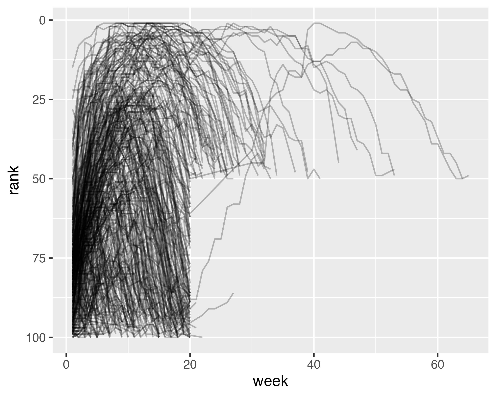

## 5) Data Tidying

We will learn a consistent way to organize your data in R using a system called *tidy data*. Getting your data into this format requires work, but that work pays off in the long term. We will first learn the definition of tidy data, then we will dive into the primary tool we use for tidying data: pivoting. Pivoting allows you to change the form of your data without changing any of the values.

---

### Tidy Data

There are three interrelated rules that make a dataset tidy:
-  Each variable is a column; each column is a variable
- Each observation is a row; each row is an observation
- Each value is a cell; each cell is a single value

There are two main advantages to tidy data: i) if you have a consistent data structure it is easier to learn the tools that work with it because they have an underlying uniformity, and ii) most built-in R functions work with vectors of values, which is easier with variables in columns.

Most analyses will require at least a little tidying. First you begin by figuring out what the underlying variables and observations are, then you pivot your data into a tidy form, with variables in the columns and observations in the rows. tidyr provides two functions for pivoting data: $\texttt{pivot\_longer()}$ and $\texttt{pivot\_wider()}$.

---

### Lengthening Data

Let us look at the billboard dataset which records the Billboard rank of songs in the year 2000.

```r
# Code 1
# The billboard dataset
billboard
```

```output
# A tibble: 317 × 79
   artist     track date.entered   wk1   wk2   wk3   wk4   wk5   wk6   wk7   wk8
   <chr>      <chr> <date>       <dbl> <dbl> <dbl> <dbl> <dbl> <dbl> <dbl> <dbl>
 1 2 Pac      Baby… 2000-02-26      87    82    72    77    87    94    99    NA
 2 2Ge+her    The … 2000-09-02      91    87    92    NA    NA    NA    NA    NA
 3 3 Doors D… Kryp… 2000-04-08      81    70    68    67    66    57    54    53
 4 3 Doors D… Loser 2000-10-21      76    76    72    69    67    65    55    59
 5 504 Boyz   Wobb… 2000-04-15      57    34    25    17    17    31    36    49
 6 98^0       Give… 2000-08-19      51    39    34    26    26    19     2     2
 7 A*Teens    Danc… 2000-07-08      97    97    96    95   100    NA    NA    NA
 8 Aaliyah    I Do… 2000-01-29      84    62    51    41    38    35    35    38
 9 Aaliyah    Try … 2000-03-18      59    53    38    28    21    18    16    14
10 Adams, Yo… Open… 2000-08-26      76    76    74    69    68    67    61    58
# ℹ 307 more rows
# ℹ 68 more variables: wk9 <dbl>, wk10 <dbl>, wk11 <dbl>, wk12 <dbl>,
#   wk13 <dbl>, wk14 <dbl>, wk15 <dbl>, wk16 <dbl>, wk17 <dbl>, wk18 <dbl>,
#   wk19 <dbl>, wk20 <dbl>, wk21 <dbl>, wk22 <dbl>, wk23 <dbl>, wk24 <dbl>,
#   wk25 <dbl>, wk26 <dbl>, wk27 <dbl>, wk28 <dbl>, wk29 <dbl>, wk30 <dbl>,
#   wk31 <dbl>, wk32 <dbl>, wk33 <dbl>, wk34 <dbl>, wk35 <dbl>, wk36 <dbl>,
#   wk37 <dbl>, wk38 <dbl>, wk39 <dbl>, wk40 <dbl>, wk41 <dbl>, wk42 <dbl>, …
# ℹ Use `print(n = ...)` to see more rows
```

In this dataset, each observation is a song. The first three columns are variables that describe the song, then we have 76 columns that describe the rank of the song each week. The song is included as long as it was in the top 100 at some point in 2000. Here, the column names are one variable (the week), and the cell values are another (the rank). To tidy this data we will use $\texttt{pivot\_longer()}$.

```r
# Code 2
# Tidying billboard with pivot_longer()
billboard |>
  pivot_longer(cols = starts_with("wk"),
               names_to = "week",
               values_to = "rank",
               values_drop_na = TRUE)
```

```output
# A tibble: 5,307 × 5
   artist  track                   date.entered week   rank
   <chr>   <chr>                   <date>       <chr> <dbl>
 1 2 Pac   Baby Don't Cry (Keep... 2000-02-26   wk1      87
 2 2 Pac   Baby Don't Cry (Keep... 2000-02-26   wk2      82
 3 2 Pac   Baby Don't Cry (Keep... 2000-02-26   wk3      72
 4 2 Pac   Baby Don't Cry (Keep... 2000-02-26   wk4      77
 5 2 Pac   Baby Don't Cry (Keep... 2000-02-26   wk5      87
 6 2 Pac   Baby Don't Cry (Keep... 2000-02-26   wk6      94
 7 2 Pac   Baby Don't Cry (Keep... 2000-02-26   wk7      99
 8 2Ge+her The Hardest Part Of ... 2000-09-02   wk1      91
 9 2Ge+her The Hardest Part Of ... 2000-09-02   wk2      87
10 2Ge+her The Hardest Part Of ... 2000-09-02   wk3      92
# ℹ 5,297 more rows
# ℹ Use `print(n = ...)` to see more rows
```

There are three key arguments to $\texttt{pivot\_longer()}$: $\texttt{cols}$ specifies which columns need to be pivoted (i.e. which columns are not variables); $\texttt{names\_to}$ which specifies the variable stored in the column names - which we named "week"; and $\texttt{values\_to}$ which specifies the variable stored in the cell values - which we named "rank". Note that 2 Pac's "Baby Don't Cry" was only in the top 100 for 7 weeks, and all the remaining weeks were filled in with missing values. We can get rid of them in our restructured dataset by setting $\texttt{values\_drop\_na}$ = TRUE.

This data is now tidy, but we could make future computation easier by converting values of week from character strings to numbers using $\texttt{mutate()}$ and $\texttt{readr::parse\_number()}$ which extracts the first number from a string.

```r
# Code 3
# Tidying billboard with pivot_longer() and mutate()
billboard_longer <- billboard |>
  pivot_longer(cols = starts_with("wk"),
               names_to = "week",
               values_to = "rank",
               values_drop_na = TRUE) |>
  mutate(week = parse_number(week))

billboard_longer
```

```output
# A tibble: 5,307 × 5
   artist  track                   date.entered  week  rank
   <chr>   <chr>                   <date>       <dbl> <dbl>
 1 2 Pac   Baby Don't Cry (Keep... 2000-02-26       1    87
 2 2 Pac   Baby Don't Cry (Keep... 2000-02-26       2    82
 3 2 Pac   Baby Don't Cry (Keep... 2000-02-26       3    72
 4 2 Pac   Baby Don't Cry (Keep... 2000-02-26       4    77
 5 2 Pac   Baby Don't Cry (Keep... 2000-02-26       5    87
 6 2 Pac   Baby Don't Cry (Keep... 2000-02-26       6    94
 7 2 Pac   Baby Don't Cry (Keep... 2000-02-26       7    99
 8 2Ge+her The Hardest Part Of ... 2000-09-02       1    91
 9 2Ge+her The Hardest Part Of ... 2000-09-02       2    87
10 2Ge+her The Hardest Part Of ... 2000-09-02       3    92
# ℹ 5,297 more rows
# ℹ Use `print(n = ...)` to see more rows
```

Now that we have all the week numbers in one variable and all the rank values in another, we are in a position to visualize how songs ranks vary over time.

```r
# Code 4
# Plot of song rank over time
billboard_longer |>
  ggplot(aes(x = week, y = rank, group = track)) +
  geom_line(alpha = 0.25) +
  scale_y_reverse()
```




